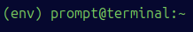

# Aplicación web para la ayuda en la toma de decisión de matriculación de los alumnos de grado de la UDC

---

## 📑 Tabla de contenidos

- [🛠️ Tecnologías](#tecnologias)
- [📝 Descripción](#descripción)
- [🐋 Instrucciones necesarias para la configuración y arranque con Docker](#docker)
- [🔴Puesta en marcha sin Docker](#sindocker)
  - [📦 Backend (Django + DRF)](#backend)
    - [Requisitos](#backend_requisitos)
    - [Configuración del entorno](#backend_config)
    - [Script de scraping](#scraping)
    - [Inicializar la base de datos](#bd)
    - [Automatización con Celery](#celery)
    - [Ejecución de los test](#test)
    - [Instrucciones para arrancar el backend](#arrancarbackend)
  - [🎨 Frontend (React + TailwindCSS)](#frontend)
    - [Requisitos](#frontend_requisitos)
    - [Configuración del entorno](#frontend_config)
    - [Instrucciones para arrancar el frontend](#arrancarfrontend)
- [👤 Autor](#autor)
- [⚖️ Licencia](#licencia)

<h2 id="tecnologias">🛠️ Tecnologías</h2>

 

---

<h2 id="descripción">📝 Descripción</h2>

Trabajo de fin de grado desarrollado con Django y React. Aplicación web que permite a un usuario:
- Registrarse. 
- Login y logout.
- Ver y editar su perfil.
- Ver los grados de la UDC.
- Realizar una búsqueda de asignaturas.
- Ver los detalles de cada grado.
- Consultar las estadísticas de cada asignatura.
- Realizar, editar y borrar comentarios en una asignatura. 
- Ver los comentarios de una asignatura.
- Ver los comentarios propios del usuario.
- Añadir y eliminar una asignatura de su lista de favoritos.
- Ver su lista de favoritos.

<h2 id="docker">🐋 Instrucciones necesarias para la configuración y arranque con Docker</h2>

Para mayor facilidad de quien pruebe la app, se ha implementado el despliegue con Docker Compose. Las instrucciones necesarias para ejecutar la aplicación web de esta forma, en un sistema operativo Ubuntu/Linux, se detallan a continuación.

1. Ubicarse en la carpeta raíz del proyecto y ejecutar los siguientes comandos, con el fin de ejecutar el script para instalar Docker y Docker Compose:
        
        chmod +x docker-instalacion.sh
        ./docker-instalacion.sh

2. Ejecutar los siguientes comandos por separado para construir las imágenes y levantar los servicios (tarda un poco):

        docker compose build --no-cache
        docker compose up

3. Cuando la terminal muestre algo como lo que se ve en la siguiente imagen, la app web está lista para ser utilizada:

        

4. Desde un navegador, acceder a las direcciones del backend o el frontend:

        - Backend

        http://localhost:8000/docs 
        http://localhost:8000/redocs

        - Frontend
        http://localhost:4173

5. Cuando se quiera parar la ejecución de Docker, se ejecutarán los siguientes comandos:

        ctrl+c
        docker compose down -v

6. Ejecutar el siguiente comando para borrar los volúmenes creados por docker:

        docker system prune -af --volumes

<h2 id="sindocker">🔴 Puesta en marcha sin Docker (no recomendado si solo se quiere probar la aplicación web)</h2>

<h3 id="backend">📦 Backend (Django + DRF)</h3>

<h4 id="backend_requisitos">- Requisitos</h4>
- Python 3.10 o superior
- pip

<h4 id="backend_config">- Configuración del entorno</h4>

1. Abrir una terminal (y mantenerla abierta durante todo el proceso) e instalar paquetes necesarios para Python y entorno virtual:

        sudo apt install python3 python3-pip python3-venv -y
   
2. En la raíz del proyecto, crear el entorno virtual:

        python3 -m venv env

3. Ejecutar el siguiente comando para activar el entorno virtual:

        source env/bin/activate

4. Debería de verse (env) al inicio de cada linea de terminal, lo cual indica que el entorno virtual está activado:

        

5. Instalar las dependencias del proyecto:

        pip install -r backend/requirements.txt

<h3>Instrucciones para la ejecución de los scripts, test e inicialización de la base de datos (en la terminal con el entorno virtual activado)</h3>

<h4 id="scraping">🕷️ Script de scraping</h4>

1. Desde la raíz del proyecto, acceder a la carpeta /backend:

2. Ejecutar el siguiente comando:

        python scraping/scraping.py 

<h4 id="bd">🛢️ Inicializar de cero la base de datos</h4>

1. Estando en la carpeta /backend (donde está el archivo manage.py), eliminar el archivo db.sqlite3 (si existiese).

2. Ejecutar los siguientes comandos:

        python manage.py makemigrations
        python manage.py migrate

3. Ejecutar el siguiente comando para poblar la base de datos con los datos iniciales (tarda un poco):

        python manage.py poblar_bd

4. (Opcional) Crear un superusuario de Django, al que se accede mediante la dirección http://127.0.0.1:8000/admin una vez se haya levantado el servidor:

        python manage.py createsuperuser

<h4 id="celery">🥦 Automatización con Celery</h4>

Si se prefiere ejecutar las tareas de scraping y población de base de datos emulando el funcionamiento de las tareas periódicas configuradas en el proyecto con Celery, los pasos a seguir son los siguientes (señalar que para que esto funcione tendremos que haber creado la base de datos, es decir, haber ejecutado los pasos 1 y 2 de la sección "Inicializar de cero la base de datos"):

1. Asegurarse de que tenemos instalado Redis:

        redis-server --version

2. Si no lo tenemos instalado, instalarlo:

        sudo apt update
        sudo apt install redis-server

3. Una vez instalado, abrimos dos terminales y, en ambos, estando en la raíz del proyecto, activamos el entorno virtual:

        source env/bin/activate

4. En ambos terminales accedemos a la carpeta backend (cd backend) y, en uno de ellos ejecutamos el siguiente comando para poner al worker de Celery a trabajar (y lo dejamos corriendo):
   
        celery -A backend worker --loglevel=info

5. En el otro terminal ejecutamos:

        python manage.py ejecutar_tareas_celery

6. Volvemos al primer terminal, donde podremos observar como el worker ejecuta los scripts de scraping y población de base de datos.

7. Para finalizar, pulsamos ctrl+c para parar la ejecución del worker.

<h3 id="test">🛢️ Ejecución de los test</h3>

1. Con el entorno virtual activado, acceder a la carpeta /backend.

2. Ejecutar el siguiente comando:

        python manage.py test

<h3 id="arrancarbackend">Instrucciones para arrancar el backend de la aplicación</h3>

1. Con el entorno virtual activado, acceder a la carpeta /backend.

2. Ejecutar el siguiente comando:

        python manage.py runserver

3. Para acceder a la documentación una vez se ha arrancado el backend, acceder a las siguientes direcciones en un navegador:

        - Consola de administración de Django (si hemos creado un superusuario):

                http://localhost:8000/admin/

        - Documentación:

                http://localhost:8000/docs/
                http://localhost:8000/redocs/

<h3 id="frontend">🎨 Frontend (React + TailwindCSS)/h3>
<h4 id="frontend_requisitos">- Requisitos</h4>

- Node.js (recomendado: 18.x o superior)
- npm

<h4 id="frontend_config">- Configuración del entorno</h4>

1. En otra terminal distinta a la del backend, sin el entorno virtual activado, ejecutar los siguientes comandos:

        sudo apt install curl -y
        curl -fsSL https://deb.nodesource.com/setup_20.x | sudo -E bash -
        sudo apt install -y nodejs

2. Desde la raíz del proyecto, acceder a la carpeta /frontend:

        cd frontend

3. Instalar las dependencias del proyecto:

        npm install

<h3 id="arrancarfrontend">Instrucciones para arrancar el frontend de la aplicación</h3>

1. Estando en la carpeta /frontend, ejecutar el siguiente comando:

        npm run dev

2. En un navegador, acceder a la dirección:
        
        http://localhost:5173

<h2 id="autor">👤 Autor</h2>

**Daniel Jueguen Pérez**  
- GitHub: [DanielJueguenPerez](https://github.com/DanielJueguenPerez/)  
- Email: d.jueguen@udc.es

<h2 id="licencia">⚖️ Licencia</h2>

Este proyecto está bajo la licencia MIT. Ver [LICENSE](LICENSE).
